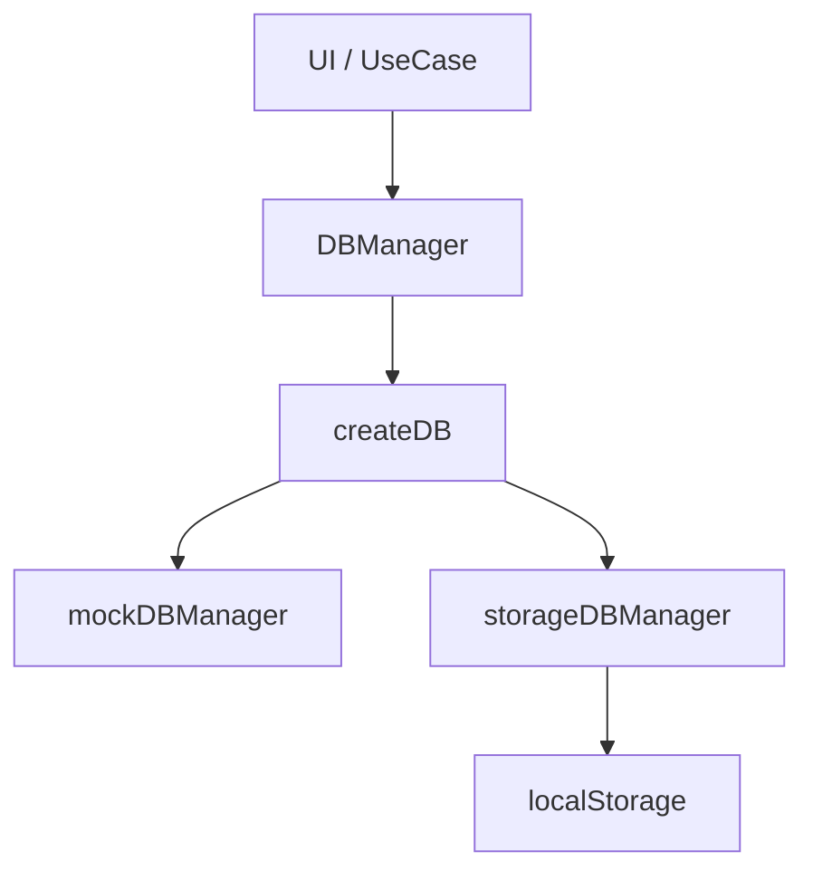
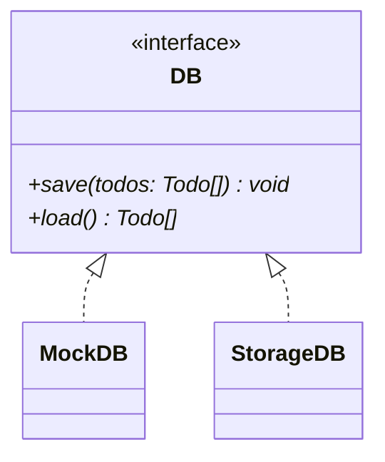
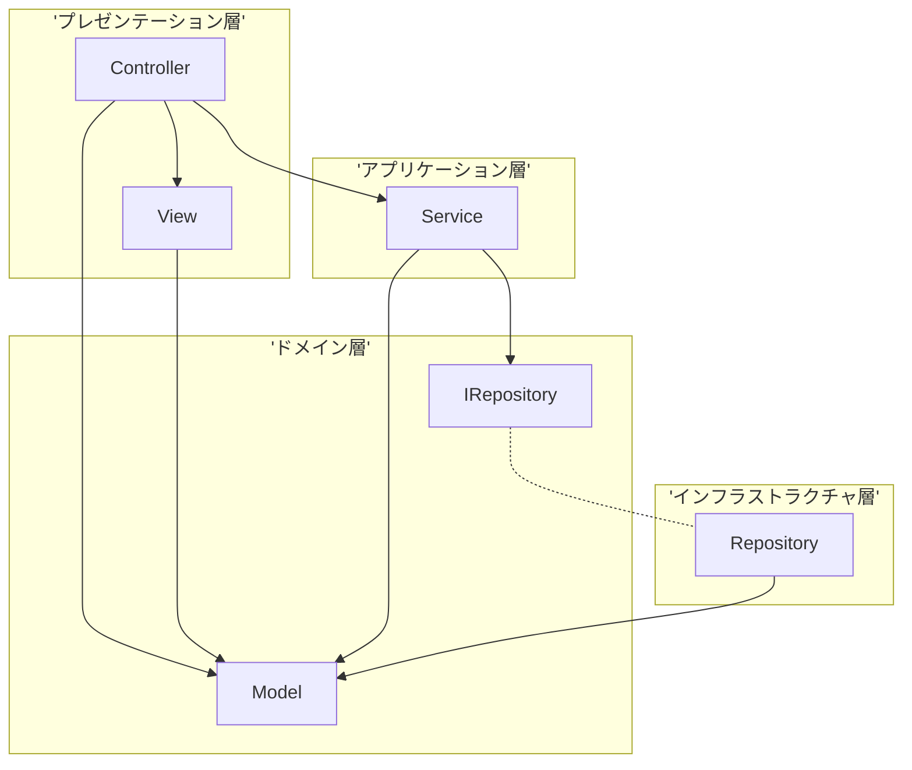
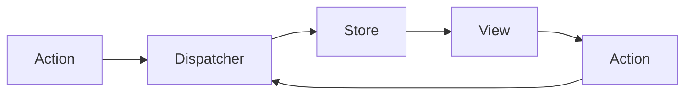

# 更新履歴

## 2026-05-05

### pseudoDB ブランチ

データベースへの保存・読み込み機能を追加するためブランチをきる。

実際のデータベース操作を実装する予定はないが、雰囲気だけでもつかんでおくための機能

-> ローカル / セッションストレージ、または JS オブジェクトへの save(), load() メソッドをもつオブジェクトに任せる

TodoDataBase というインターフェイスを定義し、これを関数の返り値の DB オブジェクトとして実装する

#### 依存関係



#### クラス図



DB オブジェクトを返す関数 createDB は、種別 (モックなのかストレージなのか、API 経由での実際の DB 操作なのか) と依存 (localStorage / sessionStorage, url など) を引数 config: DBConfig として受け取る。

型 DBconfig は　discriminated union type で定義、Extract<DBConfig, {label: DBLabel}> で取り出せるようにしておく。

save(), load() はそれぞれ Promise<void>, Promise<Todo[]> を返す。

## 2026-05-21

`ConfigFor<L extends DBLabel>` という型を追加することで、Mapped Types による FactoryMap Pattern と discriminated union を両立するように変更。

## 2026-05-24

- README.md 内の `docker-compose` コマンドを `docker compose` に変更 (ハイフンからスペースに)。
- docker-compose.yml に volumes を追記。ローカルでの変更がコンテナ内に反映されるように。

> [!NOTE]
> TypeScript のファイルを変更した場合は docker exec -it <コンテナ名> ash してから pnpm run build する。
> ash なのは alpine をベースイメージに使用しているため。
> pnpm run build のあとは Ctrl + F5 でページリフレッシュすること。

## 2026-05-29

### volumes によるバインドのための修正

- http-server は dist/ をルートにするよう変更
- public/ ディレクトリを作成し、index.html, style.css をそちらに移動
- ./src:/app/src, ./public:/app/public とし、dist/ はマウントしないように
- Dockerfile から、`RUN ln -s ../dist src/dist` という行をコメントアウト
- `pnpm run build` コマンドで .ts のコンパイルと、public/ から dist/ へ index.html, style.css がコピーがおこなわれるように

### ディレクトリ構成

```
// ===========
// --- old ---
// ===========

// local
14/
├── dist/
├── src/
│   └── main.ts
│   └── index.html
├── package.json
├── tsconfig.json
└── Dockerfile

// container
14/
├── src/ // http-server のルート
│   └── main.ts
│   └── index.html
│   └── dist/
│       └── main.js // ビルド成果物
├── dist/
// ...

// ===========
// --- new ---
// ===========

// local
14/
├── src/
│   └── main.ts
├── public/
│   └── index.html
├── dist/
├── package.json
├── tsconfig.json
└── Dockerfile

// container
14/
├── src/
│   └── main.ts
├── public/
│   └── index.html
├── dist/ // http-server のルート
│   └── index.html
│   └── main.js
├── package.json
├── tsconfig.json
└── Dockerfile
```

上記以外の変更:

- /Todostore/index.ts 内の setInitial() のバグを修正

  ```TypeScript
  /*
  dispatch() に (_) => [...todos] という関数をわたすべきところを、誤って (_) => ({ ...todos }) をわたしていた
  */

  // 発見
  const array: number[] = [0, 1, 2];
  const notArray: number[] = { ...array }; // コンパイルエラーにならない

  Array.isArray(notArray); // -> false
  notArray.map((e) => e); // 実行時エラーになる
  notArray.push(3, 4, 5); // 実行時エラーになる
  ```

## 2026-06-03

- todoActions.add() から、ValidInputs を受け取って todo をつくるロジックを分離
- generateTodo.ts を新規作成して、submitButton のイベントリスナ内で呼ぶ

## 2026-06-12

- readonly を明示することで、immutablity を型レベルで担保: Todo, priorityMap, keyAndElmList
- コード全体へのコメントの追加

### todoManipulation ブランチ

ブランチを作成。

todoManipulation ブランチで追加する機能：

- 期限切れ・完了済みのタスクを削除できる機能（個別・一括）
- 重要度や期日に応じてタスクをソートできる機能
- 重要度や期日でタスクをフィルターし、絞り込める機能

#### 構想

- remove: todoActions.remove() を削除ボタンにリスナ登録する。
- sort, filter: 直接 todoStore をいじらないようにする必要あり。
- view だけの state をつくる？ -> 仮想 DOM など

### todo の id について

もとの todoId の仕組みだと、ロードしたものと重複する問題あり。generatTodoId() IIFE の count は load() したデータを知らない。

- 変更： load() した際に generateTodoId() を実行して id を振りなおす

> [!NOTE]
>
> 正直あまりよい実装とは思えない。本当はバックエンドでやるべき処理？

## 2026-06-14

- Docker がうまく動かないので、wsl2 のアップデートと Docker Desktop の再インストールをおこなったところ、問題なく機能するようになった。
- generateTodoId() への変更: Result 型を返す形に。1,000,000 件を超えるデータは登録しないようにした。

## 2026-06-22

### createElement.ts

viewTodo の準備段階として、createElement.ts を変更する。

- パラメータ props を options に改名。キー: 許可された属性名とその値: string のみ -> キー: onClick, onChange, onInput と値: イベントリスナ ((...args: unknown[]) => void) も許可
- validatorMap と grantorMap を統合。以下の（模擬的な）交差型の optionsHandler をかわりにつかう。

  ```TypeScript
  type OptionHandler =
    & { [key in AllowedPropsKey]: { validator: (val) => val is string, apply: (el, val) => {el['属性名'] = val} } }
    & { [key in AllowedEventsKey]: { validator: (val) => val is fn, apply: (el, val) => {el.addEventListerner(`${イベント種別}`, val)} } }
  ```

renderer.ts も追随する形で変更した。

## 2026-06-23

### viewTodoStore

`type ViewTodo = Todo & { toDisplay: boolean };` として、描画を制御する state (= ViewTodo[]) とその store インスタンスを作成。
viewTodoActions に　change(), sortBy(), filter() の dispatch 処理をまとめた。

これは Todo[] の派生状態にすぎないので、この方針は破棄する。

かわりに、filterState, SortState をあらたにつくり、Todo[] とこれらを組み合わせて描画をおこなうことにする。

## 2026-06-27

- todoStore が管理する state を従来の Todo[] から以下の形に変更。

```TypeScript
TodoState = {
  todos: Todo[],
  filterState: FilterState,
  sortState: { type: TodoKey, order: 'ascend' | 'descend' }
}
```

- todoStore.watch() の selector として、 computeVIeTodos() と selectViewTodos() を定義し、state 自体から 描画の際の監視対象を組み立てるように。

- 削除ボタンを実装。あわせて renderer.ts の重複した記述の簡略化も済ませる。

## 2026-06-28

- createElement() にジェネリクスを使い、戻り値の型を絞り込みできるように。

```TypeScript
function createElement<T extends AllowedTagName>(
  tagName: T,
  oprions: CreateElementOptions = {},
  ...children: (HTMLElement | string)[]
): HTMLElementTagNameMap[T] /* ブラケット記法による interface HTMLElementTagNameMap へのアクセス */{
  // ...
}
```

### className: 'is-expired' / isExpired: boolean

検討：

1. Todo に `isExpired: boolean` を持たせるべきか？
2. isFutureOrToday() の再利用 -> どこで呼ぶか？
3. ユースケースを考える:
   1. html 要素にクラス名 .is-expired をつけて装飾する。
   2. removeAll() で `isDone: true` と `isExpired: true` の要素をすべて消す

      > - [x] 完了済み
      > - [x] 期限切れ

      > のタスクをすべて消す [実行 (ボタン)]

3.2. は array.prototype.filter に渡す関数で対応可能。 `isExpired: boolean` は `deadline: ValidDeadline` (と now) の派生状態にすぎない。

```TypeScript
interface RemoveAllMode {
  readonly removeDone: boolean;
  readonly removeExpired: boolean;
}

interface UIState {
  readonly removeAllMode: RemoveAllMode;
  readonly removeDialogOpen: boolean;
}

const uiStore = createStore<UIState>({
  removeAllMode: { removeDone: true, removeExpired: false },
  removeDialogOpen: false
})

todoActions = {
  // ...
  removeAll: (mode: RemoveAllMode) =>
    todoStore.dispatch((s) => ({
      ...s,
      todos: s.todos.filter(
        // 短絡評価:
        // 1. mode.removeDone === true の時だけ t.isDone をチェック
        // 2. 1. が false なら 3. をチェック
        // 3. mode.removeExpired === true の時だけ isFutureOrToday(t.deadline) をチェック
        // 1. 3. どちらかが false を返す t だけ抽出
        // つまり、removeDone モードなら isDone を、removeExpired モードなら expired を削除
        (t) => !((mode.removeDone && t.isDone) || (mode.removeExpired && !isFutureOrToday(t.deadline)))
      )
    })),
};
```

3.1. は描画時に isFutureOrToday() を呼べば問題ない。

## 2026-06-29

上記の 3.1. をいったん実装する。

## 2026-06-30

### 差分の追跡

db.save() に常にすべての Todo[] が渡されているが、これは最終的に DB への書き込み処理であることを考えると、差分だけを反映するようにしたい。

実際に db.save() が走るのは、以下の 3 つのケース。

1. 追加 (todoActions.add())
2. 削除 (todoActions.remove())
3. 完了 / 未完了の切り替え (todoActions.toggleDone())

#### Stateful Observer

> [] createDiffs() を実装する (2026-08-08 追記)

```TypeScript
type Diff<T> = {
  before: T;
  after: T
};

type TodoDiffs = {
  added: Todo[];
  removed: Todo[];
  updated: Diff<Todo>;
};

// こんなイメージ？
const createDiffs = (() => {
  // Map 化による高速化 (O(N * M) -> O(N + M))
  // key: id, value: Todo の Map インスタンス
  let prev: Map<string, Todo> = new Map([]);

  return (next: Todo[]): TodoDiffs => {
    const nextMap = new Map(next.map(t => [t.id, t]));

    // prev が空の Map なら早期リターン
    if (prev.size === 0) {
      prev = nextMap;
      return { added: next, removed: [], updated: [] };
    }

    // added: 以前の状態になく次の状態にあるもの
    const added = next.filter(t => !prev.has(t.id));

    // removed: 以前の状態にあって次の状態にないもの
    const removed = [...prev.values()].filter(t => !nextMap.has(t.id));

    // updated: 以前の状態と次の状態で参照が違うもの
    const updated = next.map(t => {
      const oldTodo = prev.get(t.id);
      if (oldTodo && oldTodo !== t) {
        return { before: oldTodo, after: t };
      }
      return;
    }).filter(d => d != null);

    // update memo
    prev = nextMap;

    return { added, removed, updated };
  }
})()
```

#### 役割分担

- Store: truth を保持する
- Selector: State から描画用データを生成する純粋関数
- Stateful Observer: 前回状態との差分を追跡する
- Rederer / Persistence: 差分を消費する

#### SQL のおさらい

```sql
-- SQL のイメージ

-- $... はサーバーサイドでくっつける

-- users テーブルの作成
CREATE TABLE users (
  id INT AUTO_INCREMENT PRIMARY KEY,
  username VARCHAR(40) NOT NULL,
  -- 認証用
  -- メールアドレス & パスワード認証は脆弱だが、とりあえず
  email VARCHAR(100) NOT NULL UNIQUE,
  password_hash VARCHAR(255) NOT NULL,
  created_at TIMESTAMP DEFAULT CURRENT_TIMESTAMP
);

-- TODO テーブルの作成
-- id と created_at でインデックスを張る
CREATE TABLE todos (
  id INT AUTO_INCREMENT PRIMARY KEY,
  user_id INT NOT NULL,
  title VARCHAR(100) NOT NULL,
  priority VARCHAR(10) NOT NULL,
  deadline DATETIME NOT NULL,
  is_done BOOLEAN NOT NULL,
  created_at TIMESTAMP DEFAULT CURRENT_TIMESTAMP
);

-- 読み込み
-- 40 件ごとのページネーション
SELECT id, title, priority, deadline, is_done
  FROM todos
  WHERE user_id = $user_id
   AND is_done = FALSE --                 -- 未完了のタスクのみ
   AND created_at < $last_seen_created_at -- 前回取得分の続きから
  ORDER BY created_at DESC --             -- 作成日時の降順で並べる
  LIMIT 40; --                            -- 40 件を上限として取得

-- 追加
INSERT INTO todos
  VALUES($id, $user_id, $title, $priority, $deadline, $isDone);

-- 削除
DELETE FROM todos
  WHERE id = $id;

-- 書き換え
UPDATE todos
  SET is_done = $is_done
  WHERE id = $id;
```

## 2026-07-03

### トランザクション

> 従来の todos のデータフロー:
>
> input -> dispatch -> state の確定 -> db.save(todos) & render(todos)

これはおかしい。db.save() は失敗する可能性がある。以下のようなフローであるべき。

> あるべき todos のデータフロー:
>
> input -> try db.save(input)
>
> -> success: dispatch -> state の確定 -> render(todos)
>
> -> failure: state は更新せず

#### commitTodos()

todoActions の add(), toggleDone(), remove() つまり INSERT, UPDATE, DELETE につながる処理は db.save() を通すようにした。DB への書き込みが失敗した場合、Store 内の State を更新する処理も実行されない。

```TypeScript
async function commitTodos(updater: (todos: Todo[]) => Todo[]) {
  const current = todoStore.state;
  const next: TodoState = {
    ...current,
    todos: updater(current.todos)
  };

  try {
    await db.save(next.todos); // throwable

    todoStore.dispatch(() => next);
  } catch (e) {
    if (e instanceof Error) console.error(e.message);
    console.error('unknow error occured.');
  }
}
```

### todo_id

現在の　generateTodoId() では、複数ユーザ間で重複が発生するため、ほかの方法を検討する必要がある。

候補としては、以下のものが挙げられる。

| 候補                 | 作成方法                           | 利点                           | 欠点                                     |
| :------------------- | :--------------------------------- | :----------------------------- | :--------------------------------------- |
| DB 内 AUTO_INCREMENT | INSERT 時に自動                    | 外部依存なし                   | add() 時に id をバケツリレーする必要あり |
| UUID v4              | クライアントで crypto.randomUUID() | 外部依存なし、バケツリレー不要 | 後述 [^1][^2]                            |
| UUID v7              | クライアントで uuid ライブラリ     | バケツリレー不要               | 外部依存あり                             |

[^1] DB の設計上、多数のユーザーがひとつの todos テーブルを共有して TODO を追加していくので、RDBMS のインデックスのデータ構造 (B-Tree) 上はシーケンシャルな値が望ましい。UUID v4 はシーケンシャルではないので、インデックスを張る場合、途中への無理やりな挿入が起こり、ページスプリットによる断片化 (fragmentation) が発生してパフォーマンスが落ちる。

[^2] crypto.randomUUID() は Secure Context (HTTPS / h\ttp://127.0.0.1, h\ttp://localhost, http://\*.localhost などのローカル開発環境) でなければ動作しない。

> [!NOTE]
>
> 2026-07-08 追記:
> UUID v4 / v7 (16 進法、ハイフン含め 36 文字) を採用する場合、値の型を VARCHAR(36) ではなく適切なものに設定する。
>
> - BINARY(16) / MySQL
> - UUID / PostgreSQL
>
> また、36 文字の文字列は URL としては長すぎるため、DB の外部では Base58 エンコーディングをもちいて 21 - 22 文字程度に短縮する。

## 2026-07-06

### context 層の分離

現在のコードでは、オブジェクトリテラルをもちいて直接 todoActions オブジェクトを作成している。

```TypeScript
// /todoPersistence/index.ts
export db = createDB(config);

export function commitTodos(updater) {...}
// /todoActions/index.ts
import { todoStore } from '...';
import { db, commitTodos } from '...';

const todoActions = {
  // todoStore, commitTodos() を使うメソッド
};
```

これを、ひとつレイヤーを追加することで DB インスタンスを DI して todoActions を返す関数の定義と、その使用にわける。

```TypeScript
// import / export は基本的に省略
// /src/lib/createStore.ts
type Store<T> = ReturnType<typeof createStore<T>>;

// --- Logic Layer ---
// /src/actions/todoActions.ts
function createTodoActions = (
  dependencies: {
    todoStore: Store<TodoState>,
    db: TodoDataBase
  }
): TodoActions {...};

// --- App Context Layer ---
// /src/context/....ts
const todoStore = createStore<TodoState>({...});
const db = createDB(config);

export const todoActions = ({ todoStore, db }); // DI

// --- UI Layer ---
// /src/component/....ts
import { todoActions } from '...';

// ...
submitButton.addEventListener('click', todoActions.add(...));
// ...
```

## 2026-07-12

### アーキテクチャ

MVC パターンと 4 層アーキテクチャを組み合わせた設計は、以下のような図で表される。



現状のコードの Store まわりは Flux (下図) に近いパターンで実現されている。



### removeAll()

> todoManipulation ブランチで追加する機能：
>
> - 期限切れ・完了済みのタスクを削除できる機能（個別・一括）
> - 重要度や期日に応じてタスクをソートできる機能
> - 重要度や期日でタスクをフィルターし、絞り込める機能

これまでの時点で、構想していた機能はほぼ実装できた。
あとは「期限切れ・完了済みのタスクを一括削除できる機能」を追加すれば、todoManipulation ブランチでの作業をもう一段階先へすすめられる。
(Todo[] 全体をいちいち描画したり db.save() に渡す形から、差分をとりだして反映する方式へ移行する作業がまだある。)

そのために必要な具体的なオブジェクトや処理は、以下の通り。

- UIStore
- RemoveAllDialog
- todoActions.removeAll()

## 2026-07-21

### todoManipulation ブランチ

todoManipulation ブランチを main ブランチにマージする。

## 2026-07-22

main から develop ブランチを分離。基本的には develop ブランチで開発を進めていく。

これまでの雑多な更新を一つのブランチで進めていくやり方を改め、ブランチごとの責務を考えてそれを明確化した名前を付けていく。

### refactor/render-form ブランチ

まずは todoForm コンポーネントのリファクタリングを進めていく。main() で取得した DOM 要素を弄り回すのをやめ、ほかのコンポーネント同様に render...() を都度呼ぶ設計にする。

これによって達成できることは、主に以下の三つ。

1. main() が DOM を必要以上に知りすぎなくてよくなる。
2. index.html がただの入れ物になる。コードの凝集性が高まる。
3. HTMLElement.addEventlistener() を createElement() に隠蔽したことを生かせる。

## 2026-07-29

refactor/render-form ブランチでの作業を終了し、develop ブランチにマージした。

### refactor/relocation-files ブランチ

utils/ 下にアプリケーション / ドメインの知識を持つ関数があるため、これらを分離する。

分離対象：

- castBranded.ts
- genaerateTodo.ts -> createTodo.ts に改名
- generateTodoId.ts

#### domain ディレクトリ

src/ 下に domain/ ディレクトリをもうける。さらにその下に Todo/ を作成し、そこに Todo にかかわるコードを集約する。

集約後、 utils/ 下のコードからドメイン知識を排除するため、 dateStringValidators.ts に変更を加え、isValidDateString() を日付文字列（'yyyy-mm-dd' 形式の実在する日付に対応する文字列）かどうかを検証するだけの関数とした。

## 2026-07-31

### Result 型の修正

一般的な慣習に合致するように Result 型のプロパティ名を変更した。

```TypeScript
type Result<D, E> = Success<D> | Failure<E>;

// old
type Success<D> = {
  readonly isSuccess: true;
  readonly data: D;
};

type Failure<E> = {
  readonly isSuccess: false;
  readonly error: E;
};

// new
type Success<D> = {
  readonly ok: true;
  readonly data: D;
};

type Failure<E> = {
  readonly ok: false;
  readonly err: E;
};
```

### validateInputValues() / validateMockData() のリファクタリング

createErrors() などほぼ共通の関数なので、共通化する。

すべての検証結果が ok なら Success<...> を返す節を共通化しようとしたが、型推論がうまくいかないので断念した。

### ** やるべきこと **

> - [x] Docker コンテナを起動してモックデータと入力値の検証がきちんとなされているか動作確認する。

### 今後の展望

TODO:

- [x] 自動テスト・単体テストが書けるように環境構築 (Jest / Vitest ? Node.js 標準の node:test という選択肢も)
- [x] Hono フレームワークの導入
- [] バックエンドの構築
- [] DB とつなぎこむ (Docker 経由)

### node:test 導入

pnpm を ver11.18.0 にアップデートし `$ pnpm i --save-dev @types/node` を実行、tsconfig.json に `"types": ["node"]` を追記。 -> `import ... from 'node:test'; import assert from 'node:assert'; ` でテストコードが書けるように。

TODO:

> - [x] package.json に pnpm run test で node --test が走るように設定する

package.json に `"type": "module"` と `"scripts": { ..., "test": "node --experimental-strip-types --test src/__test__/*.ts" }` を追記。

## 2026-08-01

### テストファイルの import

pnpm test run 実行時に、`import { ... } from '\{file_path}.js'` としているテストコードの ts ファイルが ERROR を発生させた。コンパイル前の ts ファイルから、パスがコンパイル後のものを想定している js のモジュールを読み込むことはできない。

tsconfig.json に `--allowImportingTsExtensions` オプションを設定すれば防げるようだ。
`--allowImportingTsExtensions` オプションを有効化するには、 `--noEmit` または `--emitDeclarationOnly` オプションの有効化が前提となるらしい。これらのオプションを有効化すると、`$ tsc` コマンドで dist/ に js ファイルを出力することができなくなる。

暫定的な措置として、package.json を修正。 `"scripts": { ..., "test": "node --test dist/__test__/*.js" }` として、ビルド後の js ファイルをテスト対象にするように。

## 2026-08-02

### 未使用の関数を削除

エクスポートしている isKey(), isTodoKey() が参照されている箇所がないので、これらのコードを削除した。

## todoValidators.test.ts

domain/Todo/validators 内の各種の関数のテストコードを書いた。

## 2026-08-03

### mockValidators.test.ts

モック DB の初期データを検証する関数のテストコードを書く。

テスト対象：

- [x] matchTodoIdFormat()
- [x] isFirstOf()
- [x] validateMockDataSingular()

### Date オブジェクトの扱い

08-04/00:00 ごろにテストを実行したところ、isFutureOrToday() と getDateStringBefore() がうまくかみ合わず、テストが失敗した。

後者の関数内で使っていた Date.prototype.toISOString() は UTC 基準のメソッドで、前者の関数内の Date.prototype.setDate() や Date.prototype.getDate() などのローカル基準のメソッドとはタイムゾーンがずれてしまうことが原因だった。

一律でローカルタイムゾーンを基準にするよう変更し、併せて dateStringValidator.ts の関数に変更を加えた。

## 2026-08-04

### dateStringValidator の見直し

関数内で文字列の書式の検証を重複して行っている部分があった。これを改め、isValidDateString() と parseLocalDate() を削除し、isFutureOrToday() も書き換えた。

変更後の関数：

- [yyyy, mm, dd] (いずれも number 型) のタプルにパースする（マッチしないなら undefined を返す）parseLocalDateNums()
- タプルを受け取って実在する日付かを検証する isValidDateNums()
- タプルを受け取って期日を過ぎていないかを検証する isFutureOrToday()

### computeViewTodos.ts 内の比較ロジックのテスト

未着手なので書きたい。 -> 書いた。

## 2026-08-05

### deadline 関係のテストの見直し

#### 現状

- 外から引数として Date オブジェクトを渡せるように、一部の関数にデフォルト引数を設定している
- テスト実行時の N 日前の日付について、関数で数値タプルや日付文字列を作成している。

```TypeScript
// 補助関数
/**
 * [yyyy-MM-dd] 形式のローカル日付 (e.g. JST)
 */
function formatDate(date: Date): string {
  const y = String(date.getFullYear());
  const m = String(date.getMonth() + 1).padStart(2, '0');
  const d = String(date.getDate()).padStart(2, '0');

  return `${y}-${m}-${d}`;
}

/**
 * date から \\{days} 日前の日付を表す文字列を返す
 *
 * - days の小数点以下は切り捨てる。
 * @param date 基準となる日に対応する Date オブジェクト
 * @param days 遡りたい日数
 * @returns [yyyy-mm-dd] 形式の \\{days} 日前の日付文字列
 */
export function getDateStringBefore(date: Date, days: -1 | 0 | 1 | 2): string {
  const copy = new Date(date);
  copy.setDate(copy.getDate() - days);

  return formatDate(copy);
}

/**
 * date から \\{days} 日前の日付を表す数値のタプルを返す
 *
 * - days の小数点以下は切り捨てる。
 * @param date 基準となる日に対応する Date オブジェクト
 * @param days 遡りたい日数
 * @returns [yyyy, mm, dd] の \\{days} 日前の数値タプル
 */
export function getDateTupleBefore(date: Date, days: -1 | 0 | 1 | 2): [number, number, number] {
  const copy = new Date(date);
  copy.setDate(copy.getDate() - days);

  return [copy.getFullYear(), copy.getMonth() + 1, copy.getDate()];
}
```

#### 問題

- 現状のふたつのアプローチはテストのためだけのもので、アプリケーションの本質的なロジックではない。
- テストのために N 日前の日付を動的に生成していることで、テストの前提が外部からは不明瞭になっている。
- Date オブジェクトを引数にすることで、テスト時にバケツリレーが発生しうる。

#### 解決策

Date をモックする。

```TypeScript
import { describe, it, type TestContext } from 'node:test';

describe('mocks the Date object', () => {
  it('use TestContext mock timers enable() method', (t: TestContext) => {
    t.mock.timers.enable({ apis: ['Date'] });
  });
});
```

## 2026-08-06

### バックエンド開発の準備

これまで作業を進めていたクライアントサイドのファイルをほぼすべて frontend/ 下に移植した。新規に　backend/ ディレクトリを作成し、バックエンド開発の土台とした。

pnpm-workspace.yaml を root/ 直下に作成し、全体をワークスペース化した。

## 2026-08-07

### リファクタリング案

1. ~~frontend/src/components/ 内のコンポーネントについて、
   \<button> 要素など共通のコンポーネントを別関数に切り出して、
   components/common/ ディレクトリ下に置いて export する。~~

   ```TypeScript
   // e.g. ボタンコンポーネント
   export function createButton(
     ops: CreateElementOptions,
     ...children: (HTMLElement | string)[]
   ): (
     ops: CreateElementOptions,
     ...children: (HTMLElement | string)[]
   ) => HTMLButtonElement {
     return (
       ops: CreateElementOptions,
       ...children: (HTMLElement | string)[]
     ) => createElement('button', {
       type: 'button',
       ...ops
     }, ...children)
   }
   ```

   > REJECT:
   > たいしてコード量が削減できない

2. > [] components/ 内のコールバック関数を `onChange: $functionName` の
   > 形から `onChange: ($param) => $functionName($param)` の形に。

   -- なぜそうするのか？

   関数名だけを書く、つまり「引数を明示せずに関数オブジェクトを直接渡す」記法を Point-free style という。関数型言語において広く用いられる記法だが、様々な問題がある。

   cf. [Zenn | TypeScriptでPoint-free styleが非推奨とされる理由](https://zenn.dev/aldagram_tech/articles/00c849a61f5e86)

3. > [] isCloseToDeadline() の移植

   components/TodoTable/computeViewTodos.ts 内の isCloseToDeadline() はかなりドメインロジック寄り。プレゼンテーション層がドメイン知識をもつべきではない。

### Hono の導入

root/ で次の CLI コマンドを実行：`pnpm add hono @hono/node-server --filter backend`

backend/tsconfig.json に `--allowImportingTsExtensions` を設定。
TS ファイルを直接 import できるようにした。node:24 の機能を使って直接 TS ファイルを実行している方針にマッチしている。

backend/ で空のディレクトリをいくつか作成。将来的な設計を見据えた構成の下準備をする。

`curl http://localhost:3000/health` でヘルスチェックができるようにした。

### Why Hono?

#### ほかの候補の検討

- Ruby on Rails や PHP Laravel、 Python Flask / Django / FastAPI など、バックエンドフレームワークには魅力的な選択肢はたくさんあるものの、練習用の TODO アプリ開発のために別の言語をこれから習得するのは、現実問題としてやりすぎ
- よしんば別言語を習得するにしても、MVC アーキテクチャががっつりビルトインされている Ruby on Rails はこのプロジェクトでやりたいことと合わない（でもバックエンドの入門には非常に良さそう）
- Next.js や Nest.js などは特定のフロントエンドライブラリやフレームワークを前提としている雰囲気があるし、どうせなら React / Vue.js + Vite などのスタックで挑戦したい
- Next.js は **初心者向けではない** (SSR などを学ぶには良いかも、今はスキルが足りない)
- とはいえフレームワークなしで Node.js の標準機能のみでバックエンドを開発するのはしんどい
- 同じようにミニマルな JS / TS バックエンドフレームワークの Express は Node.js を前提にしているため、ほかのランタイム -- Deno, Bun や AWS Lambda, Cloudflare のエッジサーバ -- で動かないことがある

#### Hono を採用する利点

- TypeScript で書くことができるため、別の言語を習得する手間がない
- 外部依存がない：ミニマルな現在のプロジェクトにピッタリ
- 必要なものがほぼそろっているため、追加でパッケージをインストールする必要がない
- 上記二つの利点の結果として、JS パッケージサプライチェーン攻撃へのリスクも低減できる
- 開発者が日本人なので、日本語のドキュメントが充実している
- **流行っててカッコいい**

## 2026-08-09

### 環境変数

何番のポートを開放するか、ハードコーディングから環境変数へ分離するために config/ ディレクトリを作成。

backend/ に .env を作成し、 `PORT="3000"` を追加した。package.json の dev, start スクリプトに `--env-file-if-exists=".env"` を追記し、`$ pnpm --filter backend run start` -> `$ curl http://localhosst:3000` -> `{ status: ok }` を確認

### HonoRequest API

backend/src/routes/todos.ts に仮の /todos への GET, POST, PUT メソッドのハンドリングを書く。

curl コマンドでの HTTP リクエスト `-X POST` や `-X PUT` のほか、 `-H "ContentType: application/json"` オプションなどをつかってテストした。

```bash
// ヘルスチェック
$ curl http://localhost:3000/health
// expected response
'{ "status": "ok" }'

// GET method
$ curl http://localhost:3000/todos
// expected response
'{ "todos": { "list": [] } }'

// POST method
$ curl -X POST http://localhost:3000/todos -H "ContentType: application/json" -d '{ "task": "chattering and flattering", "priority": "low", "deadline": "2029-06-12" }'
// expected response
'{ "todos": { "list": [{ "id": "000001", "task": "chattering and flattering", "priority": "low", "deadline": "2029-06-12", "isDone": false }] } }'

// PATCH method (2026-08-16 変更)
$ curl -X PATCH http://localhost:3000/todos/000001 -H "ContentType: application/json" -d '{ "isDone": true }'
// expected response
'{ "todos": { "list": [{ "id": "000001", "task": "chattering and flattering", "priority": "low", "deadline": "2029-06-12", "isDone": true }] } }'

// DELETE method (2026-08-16 追加)
$ curl -X DELETE http://localhost:3000/todos/000001
// expected response
'{ "todos": { "list": [] } }'
```

### TypeScript Project References

shared/ に frontend/ と backend/ 共通の型やユーティリティ関数をまとめる。

tsconfig.json をこねくりまわしてエラーと格闘した結果、なんとか IDE 上でのエラーは解決できた。
sharad/tsconfig.json の `"include": ["src/**/*"], "exclude": ["node_modules"]` が悪さをしていたらしい？

## 2026-08-11

### pnpm workspace

typescript project reference を導入して shared/ から共通の型や関数をエクスポートする準備はできた。しかしこれでは、TS のコンパイラにファイルのインポート・エクスポート関係を伝えることはできても、Node.js がコードの依存関係を解釈できず実行することができない。

そこで、pnpm-workspace.yaml を作成してプロジェクト全体を pnpm workspace とし、frontend/ backend/ sharad/ をワークスペース内のパッケージにする。こうすることで、shared/ をローカルのオリジナルパッケージとして認識させ、Hono や node:test などと同じように `import { ... } from '@${projectName}/${packageName}';` でインポートできるようにする。

## 2026-08-14

### Todo Types の shared/ への移植

とりあえずコードを移植してインポートを書き換えると、IDE の上ではエラーなし。しかし、ビルドコマンドを実行すると TS1295 エラーが発生。

> - error TS1295:
>
> ECMAScript imports and exports cannot be written in a CommonJS file under 'verbatimModuleSyntax'.
>
> Adjust the 'type' field in the nearest 'package.json' to make this file an ECMAScript module, or adjust your 'verbatimModuleSyntax', 'module', and 'moduleResolution' settings in TypeScript.

shared/tsconfig.json に `"compilerOption": { "module": "nodenext", "moduleResolution": "nodenext" }` を追記したことでこのエラーを回避してビルドできるようになった。

しかし、これまで frontend/ の実行時に外部依存がなかったことが、ここにきて思わぬ落とし穴に。無事ビルドできたコードをもとに `pnpm --filter frontend run build` して開発サーバを立ち上げると、 `Uncaught Type Error` となった。実行時には `import { ... } from '@todo/shared';` を解決できないためである。

#### バックエンドの todos への変更

Todo のプロパティは readonly なので、従来の `testTodos[targetId].completed = completed` コードはそのままでは使えない。そこで、Factory 関数を作成して todos をその戻り値とし、簡易なクラスとして管理することにした。

また、shared/ から const 変数や型をインポートするにあたってエラーが発生したため、shared/package.json から `"export": { ... }` を削除した。

### 実行時エラーの解決策：Vite の導入

#### Vite とは

モダンフロントエンドにおいて事実上のデファクトスタンダードになっているバンドラー。開発者は Vue.js を世に送り出した Evan You その人。

バンドラーといっても、単に JS / TS ファイルの依存関係を解決してバンドルするだけでなく、開発サーバの起動や HMR (Hot Module Replacement) によるリアルタイム更新、本番環境へのリリース用のビルドまでをおこなう、一体型の開発ツールになっている。

内部では Go 言語でかかれた高速なバンドラーの esbuild や、より成熟したバンドラーの一つである Rollup をソースコードのビルドに使っている。
開発時には差分を検知し変更箇所に限って更新するため、よどみのない開発体験を実現するほか、本番用には高度なコードの分割や、必要のない部分をそぎ落とす Tree Shaking という機能をそなえており、ユーザにアプリケーションの軽快な使用感を提供することができる。

現在フロントエンドで主流となっている React や Vue、TypeScript といった技術スタックにもデフォルトで対応しており、細かな設定を必要としないことも魅力の一つ。

従来の同様のツールである Webpack では、コード量が増えるにしたがってビルドに要する時間が増え、必要な設定項目が多岐にわたったことなどから、先んじて使われ続けてきた中で育ってきたエコシステムという魅力がありながらも、多くのエンジニアが Vite を選択している。

Vite での開発を念頭に置いた JS / TS のテストフレームワークとして Vitest があり、こちらも先発の Jest を駆逐して Web フロントエンドのテストツールのベストプラクティスになっている。

## 2026-08-15

### Vite の導入完了

素直に `$ pnpm add -D vite` したあと、 `$ pnpm --filter frontend run build` (中身は `$ tsc --build &&vite build`) を試みると失敗。表示された `Exit status 3221226505` で検索すると、名前に 2 バイト文字の使われた親・祖ディレクトリが存在すると、 Windows + Vite の構成では実行ができないらしい。「.../javascript\_練習用/文系大学生のためのJavaScript入門/14」という名前に別れを告げてすべて英数字に置き換えると、問題なくビルドして開発サーバを立ち上げることができた。

バンドルは非常に高速なうえ、そこそこ量を書いてきたと思っていたコードが 1 ファイルに凝縮されている様は壮観だった。

### shared/ にうつすコードの検討

従前 frontend/Domain/Todo/ 下に置いていたコードには、View の都合に左右されない Todo に関する **契約 contract** -- まさに Domain そのもの -- が含まれていた。これは frontend/ で管理すべきものではもちろんない。

Todo のバリデーション関数の中には、Zod や Valibot のようなライブラリを導入したうえで共通のスキーマとした方が筋がいいものもある。ちょうど Hono の開発者 Yusuke Wada のつくった hono/zod-validator が提供されているので、これを追加したい。

そのほか、dateStringValidator() のようなコンテキストを選ばない関数や、createResult() のような shared/ で管理されている型にまつわるユーティリティ関数も shared/ へ移動させる。

### shared/ にうつさないもの

ユーザ入力に関係する型は Todo から切り離して、たとえば PreTodo や InputtedTodo のような型を新しく作る。当然これらを管理する責務は frontend/ に属しているので、shared/ には置かない。

また、View の描画にかかわる状態 TodoState や UIState も frontend/ の管理下である。

## 2026-08-16

- frontend/ から shared/ への共通ロジックの引っ越しの続き
- backend/src/app.ts に CORS 設定を追加、localhost:5173 からの接続を許可することで、Vite で起動した開発サーバからの API 呼び出しを可能に
- isDone の更新処理を PUT メソッドから PATCH メソッドに
- DELETE メソッドで サーバの todo の削除ができるように
- DB や id の採番に関する Gemini との会話ログを markdown にしてローカルに保存

### frontend/: DB Manager から TodoRepository へ

今の todo[] を単位とする DB Manager インターフェイスでは、API とのやり取りにそぐわない。つぎのような TodoRepository インターフェイスでフロントエンドのデータアクセスをまかなう。

```ts
// shared/
type AtLeastOne<T, U = { [K in keyof T]: Pick<T, K> & Partial<Omit<T, K>> }> = U[keyof U];

// frontend/
type InputTodo = Pick<Todo, InputKey>;
type UpdateTodo = AtLeastOne<Omit<Todo, 'id'>>;

interface TodoRepository {
  findAll(): Promise<readonly Todo[]>;
  create(input: InputTodo): Promise<Todo>;
  update(id: TodoId, input: UpdateTodo): Promise<Todo>;
  remove(id: TodoId): Promise<void>;
}
```

## 2026-08-19

- shared/ に ApiResponse の型が欲しい
- frontend/ の TodoRepository, ApiClient と backend/ の レスポンスに型の食い違いがある

## 2026-08-20

- クライアントとサーバのつなぎこみに成功！
- 初回読み込みはまだ -> 一応コードは書いたがチェックしていない
- 次はバックエンドのオブジェクトから DB へ移す

## 2026-08-23

### DB 導入の方針策定

- Repository の設計
- OOP でやっていく？
- ORM どうする？ -- 学習コストなどを勘案すると Prisma が妥当か

#### TodoRepository のインターフェイス

```ts
interface TodoRepository {
  create(newTodo: Omit<Todo, 'id'>): Promise<Todo>;
  findAll(): Promise<Todo[]>;
  findById(id: TodoId): Promise<Todo | null>;
  updateIsDone(id: TodoId, isDone: boolean): Promise<void | null>;
  deleteById(id: TodoId): Promise<boolean>;
}

class PrismaTodoRepository implements TodoRepository {
  // ...
}
```

## 2026-08-26

メモ:

- フロントから TodoDB 関連のコードは消していい
- TodoDB を前提にしている mock も消す

TODO:

- [] frontend の ApiClient に渡す url を文字列型から URL オブジェクトに
- [] backend/ の routes/todos/ にまとめているリクエスト処理を services/ にうつす

- [] postgresSQL を docker で立ち上げられるようにする
- [] Prisma を導入する
- [] フロントエンドの Dockerfile を書き直す
- [] バックエンドの Dockerfile を書く
- [] `$ docker compose up` で DB / バックエンド / フロントエンドがすべて立ち上がるようにする

検討事項:

- ざっくりプレゼンテーション層にあたるフロントエンドが、ユーザの「完了済み Todo を削除する」というユースケースに対して、「フロント側の State から削除する Todo の id を割り出す」アプリケーションロジックを担っているのはどうなのか。
- バックエンドといいつつ、API を介してフロントエンドに RDBMS との接点を提供しているだけになっている。

## 2026-08-30

TODO:

- [] ルート直下に compose.yaml を作成する（docker-compose.yml への対応は後方互換のために残されている状況）
- [] compose.yaml には `services: db: ...` を作成し、posgreSQL を起動できるようにする
