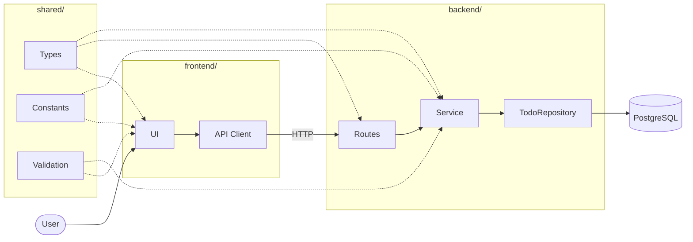

# プロジェクト構成図

## アーキテクチャ全体図

```mermaid
%% プロジェクト全体の概略図を記述する
flowchart LR
    User([User])

    subgraph Frontend["frontend/"]
        UI["UI"]
        ApiClient["API Client"]
    end

    subgraph Shared["shared/"]
        Types["Types"]
        Constants["Constants"]
        Validation["Validation"]
    end

    subgraph Backend["backend/"]
        Routes["Routes"]
        Service["Service"]
        Repository["TodoRepository"]
    end

    DB[(PostgreSQL)]

    User --> UI
    UI --> ApiClient
    ApiClient -->|HTTP| Routes
    Routes --> Service
    Service --> Repository
    Repository --> DB

    Types -.-> UI
    Types -.-> Routes
    Types -.-> Service
    Constants -.-> UI
    Constants -.-> Service
    Validation -.-> UI
    Validation -.-> Service
```
