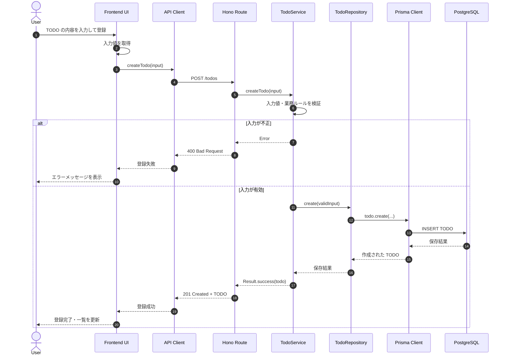

```mermaid
sequenceDiagram
    autonumber
    actor User as User
    participant UI as Frontend UI
    participant API as API Client
    participant Route as Hono Route
    participant Service as TodoService
    participant Repo as TodoRepository
    participant Prisma as Prisma Client
    participant DB as PostgreSQL

    User->>UI: TODO の内容を入力して登録
    UI->>UI: 入力値を取得
    UI->>API: createTodo(input)
    API->>Route: POST /todos
    Route->>Service: createTodo(input)
    Service->>Service: 入力値・業務ルールを検証

    alt 入力が不正
        Service-->>Route: Error
        Route-->>API: 400 Bad Request
        API-->>UI: 登録失敗
        UI-->>User: エラーメッセージを表示
    else 入力が有効
        Service->>Repo: create(validInput)
        Repo->>Prisma: todo.create(...)
        Prisma->>DB: INSERT TODO
        DB-->>Prisma: 保存結果
        Prisma-->>Repo: 作成された TODO
        Repo-->>Service: 保存結果
        Service-->>Route: Result.success(todo)
        Route-->>API: 201 Created + TODO
        API-->>UI: 登録成功
        UI-->>User: 登録完了・一覧を更新
    end
```
