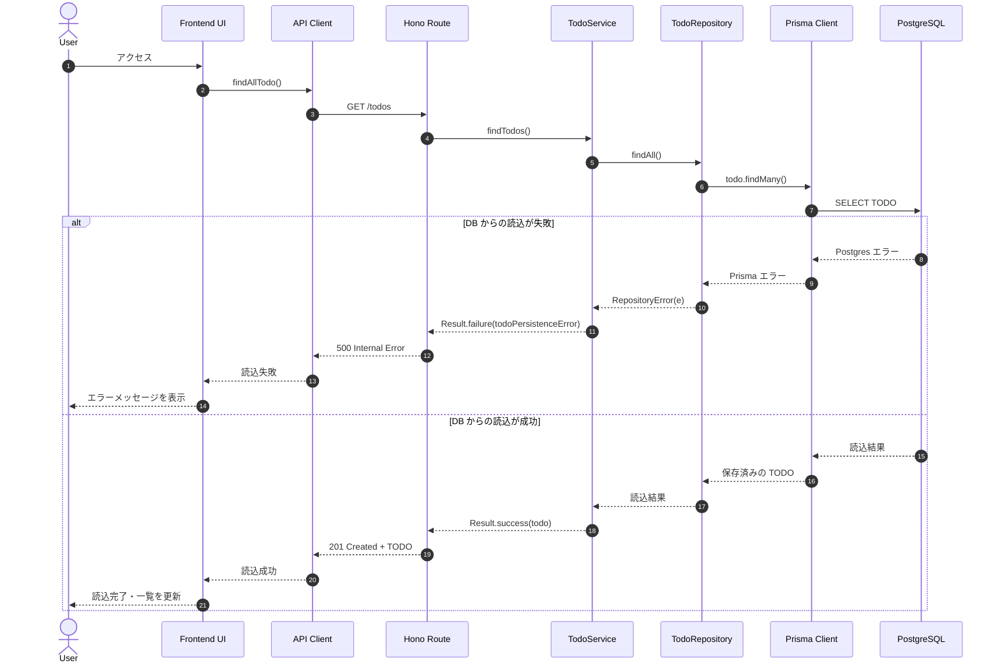
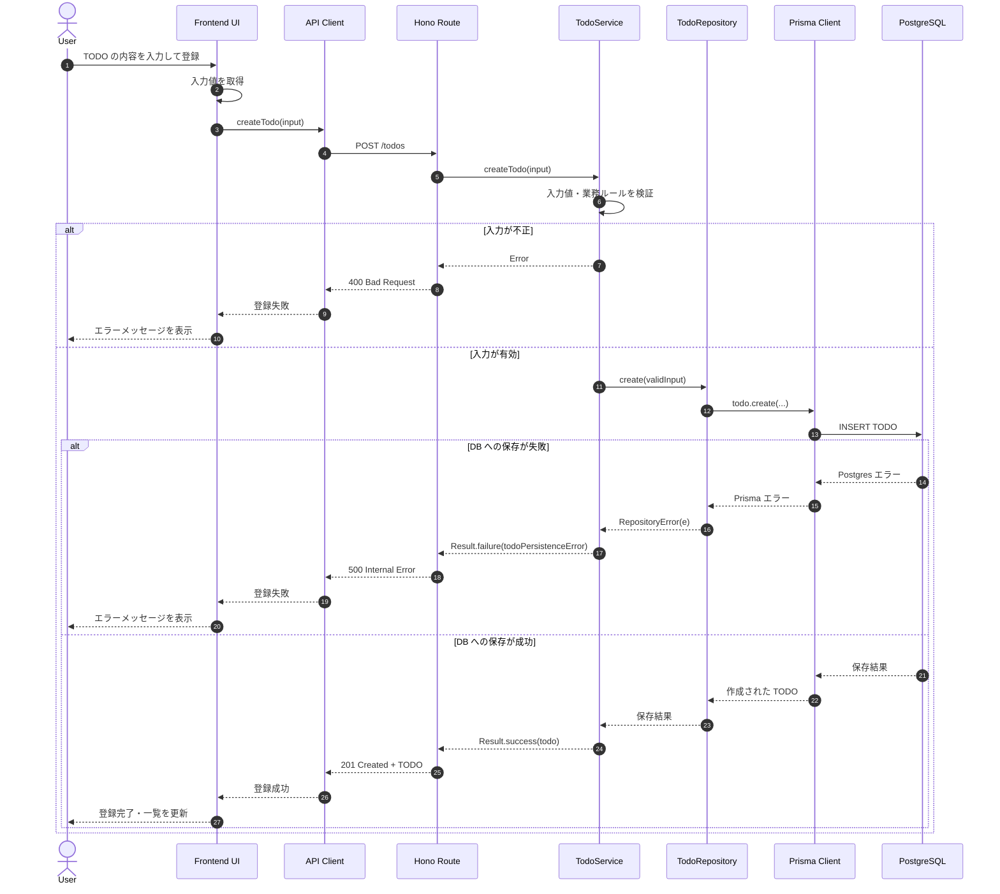
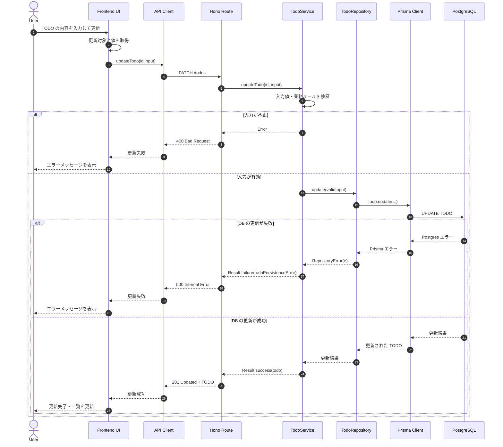

# シーケンス図

## アプリ起動時の読込

```mermaid
sequenceDiagram
    autonumber
    actor User as User
    participant UI as Frontend UI
    participant API as API Client
    participant Route as Hono Route
    participant Service as TodoService
    participant Repo as TodoRepository
    participant Prisma as Prisma Client
    participant DB as PostgreSQL

    User->>UI: アクセス
    UI->>API: findAllTodo()
    API->>Route: GET /todos
    Route->>Service: findTodos()
    Service->>Repo: findAll()
    Repo->>Prisma: todo.findMany()
    Prisma->>DB: SELECT TODO
    alt DB からの読込が失敗
        DB-->>Prisma:Postgres エラー
        Prisma-->>Repo: Prisma エラー
        Repo-->>Service: RepositoryError(e)
        Service-->>Route: Result.failure(todoPersistenceError)
        Route-->>API: 500 Internal Error
        API-->>UI: 読込失敗
        UI-->>User: エラーメッセージを表示
    else DB からの読込が成功
        DB-->>Prisma: 読込結果
        Prisma-->>Repo: 保存済みの TODO
        Repo-->>Service: 読込結果
        Service-->>Route: Result.success(todo)
        Route-->>API: 201 Created + TODO
        API-->>UI: 読込成功
        UI-->>User: 読込完了・一覧を更新
    end
```

## TODO の登録

```mermaid
sequenceDiagram
    autonumber
    actor User as User
    participant UI as Frontend UI
    participant API as API Client
    participant Route as Hono Route
    participant Service as TodoService
    participant Repo as TodoRepository
    participant Prisma as Prisma Client
    participant DB as PostgreSQL

    User->>UI: TODO の内容を入力して登録
    UI->>UI: 入力値を取得
    UI->>API: createTodo(input)
    API->>Route: POST /todos
    Route->>Service: createTodo(input)
    Service->>Service: 入力値・業務ルールを検証

    alt 入力が不正
        Service-->>Route: Error
        Route-->>API: 400 Bad Request
        API-->>UI: 登録失敗
        UI-->>User: エラーメッセージを表示
    else 入力が有効
        Service->>Repo: create(validInput)
        Repo->>Prisma: todo.create(...)
        Prisma->>DB: INSERT TODO
        alt DB への保存が失敗
            DB-->>Prisma:Postgres エラー
            Prisma-->>Repo: Prisma エラー
            Repo-->>Service: RepositoryError(e)
            Service-->>Route: Result.failure(todoPersistenceError)
            Route-->>API: 500 Internal Error
            API-->>UI: 登録失敗
            UI-->>User: エラーメッセージを表示
        else DB への保存が成功
            DB-->>Prisma: 保存結果
            Prisma-->>Repo: 作成された TODO
            Repo-->>Service: 保存結果
            Service-->>Route: Result.success(todo)
            Route-->>API: 201 Created + TODO
            API-->>UI: 登録成功
            UI-->>User: 登録完了・一覧を更新
        end
    end
```

## TODO の更新

```mermaid
sequenceDiagram
    autonumber
    actor User as User
    participant UI as Frontend UI
    participant API as API Client
    participant Route as Hono Route
    participant Service as TodoService
    participant Repo as TodoRepository
    participant Prisma as Prisma Client
    participant DB as PostgreSQL

    User->>UI: TODO の内容を入力して更新
    UI->>UI: 更新対象と値を取得
    UI->>API: updateTodo(id,input)
    API->>Route: PATCH /todos
    Route->>Service: updateTodo(id, input)
    Service->>Service: 入力値・業務ルールを検証

    alt 入力が不正
        Service-->>Route: Error
        Route-->>API: 400 Bad Request
        API-->>UI: 更新失敗
        UI-->>User: エラーメッセージを表示
    else 入力が有効
        Service->>Repo: update(validInput)
        Repo->>Prisma: todo.update(...)
        Prisma->>DB: UPDATE TODO
        alt DB の更新が失敗
            DB-->>Prisma:Postgres エラー
            Prisma-->>Repo: Prisma エラー
            Repo-->>Service: RepositoryError(e)
            Service-->>Route: Result.failure(todoPersistenceError)
            Route-->>API: 500 Internal Error
            API-->>UI: 更新失敗
            UI-->>User: エラーメッセージを表示
        else DB の更新が成功
            DB-->>Prisma: 更新結果
            Prisma-->>Repo: 更新された TODO
            Repo-->>Service: 更新結果
            Service-->>Route: Result.success(todo)
            Route-->>API: 201 Updated + TODO
            API-->>UI: 更新成功
            UI-->>User: 更新完了・一覧を更新
        end
    end
```

## TODO の削除

ほぼ同一なので省略
