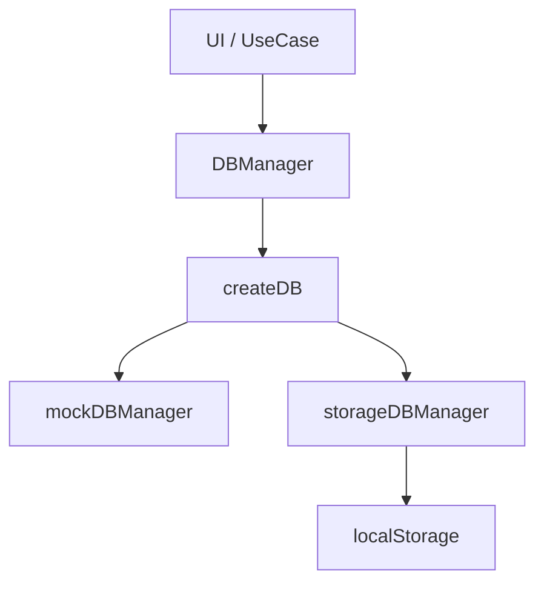
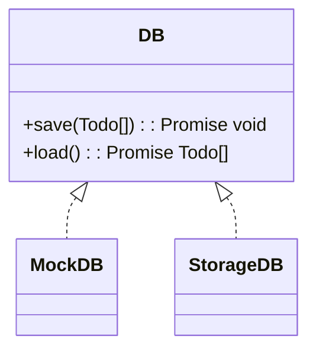

# 更新履歴

## 2026-05-05

### pseudoDB ブランチ

データベースへの保存・読み込み機能を追加するためブランチをきる。

実際のデータベース操作を実装する予定はないが、雰囲気だけでもつかんでおくための機能

-> ローカル / セッションストレージ、または JS オブジェクトへの save(), load() メソッドをもつオブジェクトに任せる

TodoDataBase というインターフェイスを定義し、これを関数の返り値の DB オブジェクトとして実装する

#### 依存関係

#### クラス図

DB オブジェクトを返す関数 createDB は、種別 (モックなのかストレージなのか、API 経由での実際の DB 操作なのか) と依存 (localStorage / sessionStorage, url など) を引数 config: DbConfig として受け取る。

型 Dbconfig は　discriminated union type で定義、Extract<DbConfig, {label: DbLabel}> で取り出せるようにしておく
