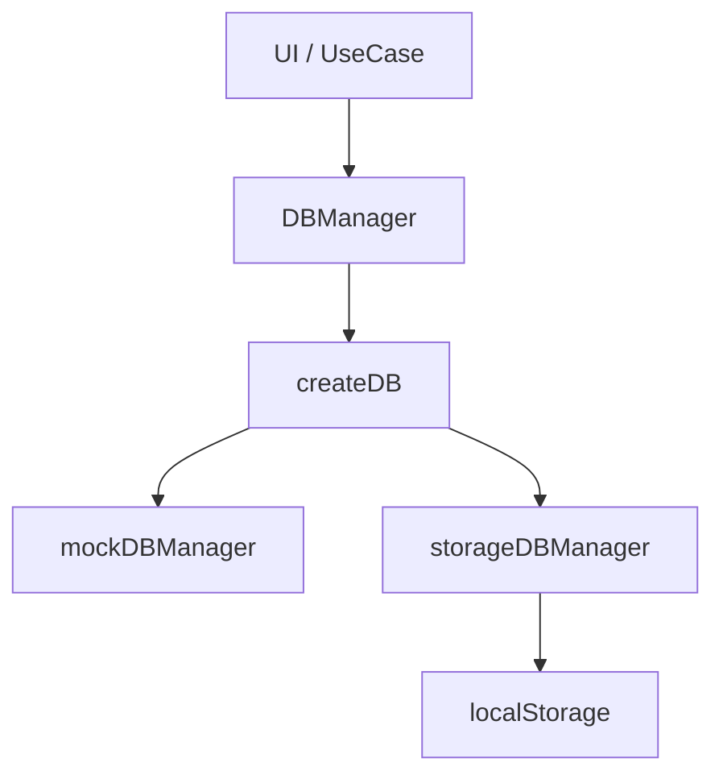
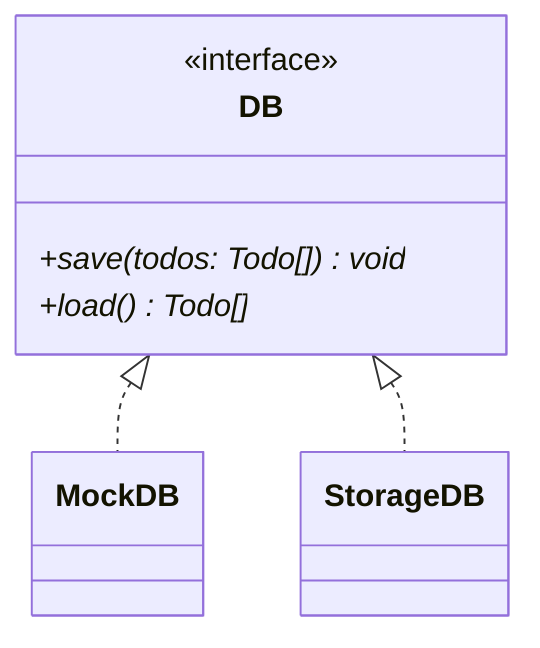

# 更新履歴

## 2026-05-05

### pseudoDB ブランチ

データベースへの保存・読み込み機能を追加するためブランチをきる。

実際のデータベース操作を実装する予定はないが、雰囲気だけでもつかんでおくための機能

-> ローカル / セッションストレージ、または JS オブジェクトへの save(), load() メソッドをもつオブジェクトに任せる

TodoDataBase というインターフェイスを定義し、これを関数の返り値の DB オブジェクトとして実装する

#### 依存関係



#### クラス図



DB オブジェクトを返す関数 createDB は、種別 (モックなのかストレージなのか、API 経由での実際の DB 操作なのか) と依存 (localStorage / sessionStorage, url など) を引数 config: DBConfig として受け取る。

型 DBconfig は　discriminated union type で定義、Extract<DBConfig, {label: DBLabel}> で取り出せるようにしておく。

save(), load() はそれぞれ Promise<void>, Promise<Todo[]> を返す。

## 2026-05-21

ConfigFor<L extends DBLabel> という型を追加することで、Mapped Types による FactoryMap Pattern と discriminated union を両立するように変更。

## 2026-05-24

- README.md 内の `docker-compose` コマンドを `docker compose` に変更 (ハイフンからスペースに)。
- docker-compose.yml に volumes を追記。ローカルでの変更がコンテナ内に反映されるように。

> [!NOTE]
> TypeScript のファイルを変更した場合は docker exec -it <コンテナ名> ash してから pnpm run build する。
> ash なのは alpine をベースイメージに使用しているため。
> pnpm run build のあとは Ctrl + F5 でページリフレッシュすること。

## 2026-05-29

### volumes によるバインドのための修正

- http-server は dist/ をルートにするよう変更
- public/ ディレクトリを作成し、index.html, style.css をそちらに移動
- ./src:/app/src, ./public:/app/public とし、dist/ はマウントしないように
- Dockerfile から、`RUN ln -s ../dist src/dist` という行をコメントアウト
- `pnpm run build` コマンドで .ts のコンパイルと、public/ から dist/ へ index.html, style.css がコピーがおこなわれるように

### ディレクトリ構成

```
// ===========
// --- old ---
// ===========

// local
14/
├── dist/
├── src/
│   └── main.ts
│   └── index.html
├── package.json
├── tsconfig.json
└── Dockerfile

// container
14/
├── src/ // http-server のルート
│   └── main.ts
│   └── index.html
│   └── dist/
│       └── main.js // ビルド成果物
├── dist/
// ...

// ===========
// --- new ---
// ===========

// local
14/
├── src/
│   └── main.ts
├── public/
│   └── index.html
├── dist/
├── package.json
├── tsconfig.json
└── Dockerfile

// container
14/
├── src/
│   └── main.ts
├── public/
│   └── index.html
├── dist/ // http-server のルート
│   └── index.html
│   └── main.js
├── package.json
├── tsconfig.json
└── Dockerfile
```

上記以外の変更:

- /Todostore/index.ts 内の setInitial() のバグを修正

  ```TypeScript
  /*
  dispatch() に (_) => [...todos] という関数をわたすべきところを、誤って (_) => ({ ...todos }) をわたしていた
  */

  // 発見
  const array: number[] = [0, 1, 2];
  const notArray: number[] = { ...array }; // コンパイルエラーにならない

  Array.isArray(notArray); // -> false
  notArray.map((e) => e); // 実行時エラーになる
  notArray.push(3, 4, 5); // 実行時エラーになる
  ```

## 2026-06-03

- todoActions.add() から、ValidInputs を受け取って todo をつくるロジックを分離
- generateTodo.ts を新規作成して、submitButton のイベントリスナ内で呼ぶ

## 2026-06-12

- readonly を明示することで、immutablity を型レベルで担保: Todo, priorityMap, keyAndElmList
- コード全体へのコメントの追加

### todoManipulation ブランチ

ブランチを作成。

todoManipulation ブランチで追加する機能：

- 期限切れ・完了済みのタスクを削除できる機能（個別・一括）
- 重要度や期日に応じてタスクをソートできる機能
- 重要度や期日でタスクをフィルターし、絞り込める機能

#### 構想

- remove: todoActions.remove() を削除ボタンにリスナ登録する。
- sort, filter: 直接 todoStore をいじらないようにする必要あり。
- view だけの state をつくる？ -> 仮想 DOM など

### todo の id について

もとの todoId の仕組みだと、ロードしたものと重複する問題あり。generatTodoId() IIFE の count は load() したデータを知らない。

- 変更： load() した際に generateTodoId() を実行して id を振りなおす

  // 正直あまりよい実装とは思えない
  // 本当はバックエンドでやるべき処理？

## 2026-06-14

- Docker がうまく動かないので、wsl2 のアップデートと Docker Desktop の再インストールをおこなったところ、問題なく機能するようになった。
- generateTodoId() への変更: Result 型を返す形に。1,000,000 件を超えるデータは登録しないようにした。

## 2026-06-22

### createElement.ts

viewTodo の準備段階として、createElement.ts を変更する。

- パラメータ props を options に改名。キー: 許可された属性名とその値: string のみ -> キー: onClick, onChange, onInput と値: イベントリスナ ((...args: unknown[]) => void) も許可
- validatorMap と grantorMap を統合。以下の（模擬的な）交差型の optionsHandler をかわりにつかう。

  ```TS
  type OptionHandler =
    & { [key in AllowedPropsKey]: { validator: (val) => val is string, apply: (el, val) => {el['属性名'] = val} } }
    & { [key in AllowedEventsKey]: { validator: (val) => val is fn, apply: (el, val) => {el.addEventListerner(`${イベント種別}`, val)} } }
  ```

renderer.ts も追随する形で変更した。

## 2026-06-23

### viewTodoStore

`type ViewTodo = Todo & { toDisplay: boolean };` として、描画を制御する state (= ViewTodo[]) とその store インスタンスを作成。
viewTodoActions に　change(), sortBy(), filter() の dispatch 処理をまとめた。

これは Todo[] の派生状態にすぎないので、この方針は破棄する。

かわりに、filterState, SortState をあらたにつくり、Todo[] とこれらを組み合わせて描画をおこなうことにする。

## 2026-06-27

- todoStore が管理する state を従来の Todo[] から以下の形に変更。

```TS
TodoState = {
  todos: Todo[],
  filterState: FilterState,
  sortState: { type: TodoKey, order: 'ascend' | 'descend' }
}
```

- todoStore.watch() の selector として、 computeVIeTodos() と selectViewTodos() を定義し、state 自体から 描画の際の監視対象を組み立てるように。

- 削除ボタンを実装。あわせて renderer.ts の重複した記述の簡略化も済ませる。

## 2026-06-28

- createElement() にジェネリクスを使い、戻り値の型を絞り込みできるように。

```TS
function createElement<T extends AllowedTagName>(
  tagName: T,
  oprions: CreateElementOptions = {},
  ...children: (HTMLElement | string)[]
): HTMLElementTagNameMap[T] /* ブラケット記法による interface HTMLElementTagNameMap へのアクセス */{
  // ...
}
```

### className: 'is-expired' / isExpired: boolean

検討：

1. Todo に `isExpired: boolean` を持たせるべきか？
2. isFutureOrToday() の再利用 -> どこで呼ぶか？
3. ユースケースを考える:
   1. html 要素にクラス名 .is-expired をつけて装飾する。
   2. removeAll() で `isDone: true` と `isExpired: true` の要素をすべて消す

      > - [x] 完了済み
      > - [x] 期限切れ

      > のタスクをすべて消す [実行 (ボタン)]

3.2. は array.prototype.filter に渡す関数で対応可能。 `isExpired: boolean` は `deadline: ValidDeadline` (と now) の派生状態にすぎない。

```TS
interface RemoveAllMode {
  readonly removeDone: boolean;
  readonly removeExpired: boolean;
}

interface UIState {
  readonly removeAllMode: RemoveAllMode;
  readonly removeDialogOpen: RemoveDialogOpen;
}

const uiStore =

todoActions = {
  // ...
  removeAll: (mode: RemoveAllMode) =>
    todoStore.dispatch((s) => ({
      ...s,
      todos: s.todos.filter(
        // 短絡評価:
        // 1. mode.removeDone === true の時だけ t.isDone をチェック
        // 2. 1. が false なら 3. をチェック
        // 3. mode.removeExpired === true の時だけ isFutureOrToday(t.deadline) をチェック
        // 1. 3. どちらかが false を返す t だけ抽出
        // つまり、removeDone モードなら isDone を、removeExpired モードなら expired を削除
        (t) => !((mode.removeDone && t.isDone) || (mode.removeExpired && !isFutureOrToday(t.deadline)))
      )
    })),
};
```

3.1. は描画時に isFutureOrToday() を呼べば問題ない。

## 2026-06-29

上記の 3.1. をいったん実装する。
