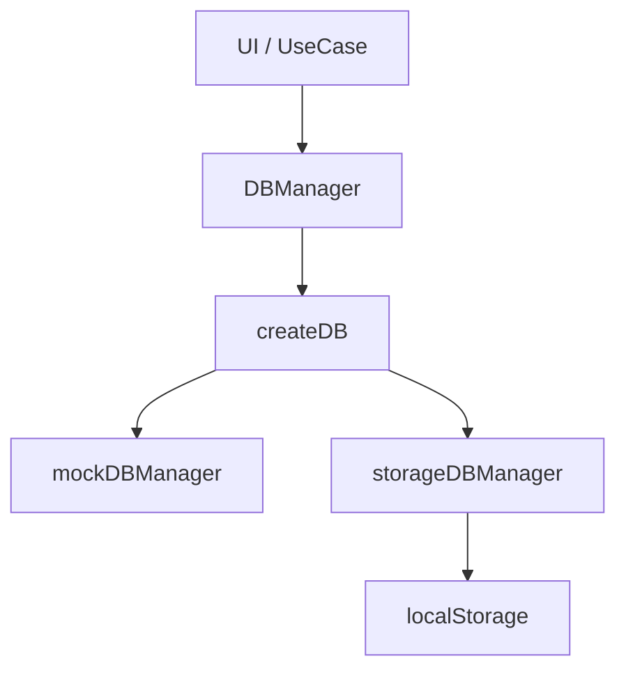
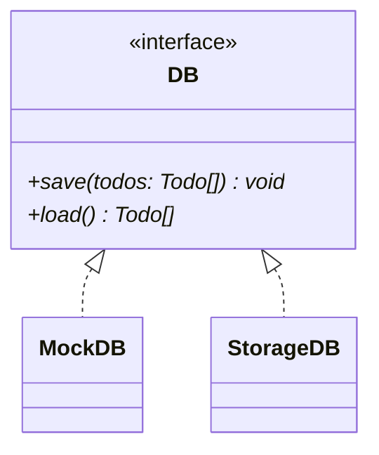

# 更新履歴

## 2026-05-05

### pseudoDB ブランチ

データベースへの保存・読み込み機能を追加するためブランチをきる。

実際のデータベース操作を実装する予定はないが、雰囲気だけでもつかんでおくための機能

-> ローカル / セッションストレージ、または JS オブジェクトへの save(), load() メソッドをもつオブジェクトに任せる

TodoDataBase というインターフェイスを定義し、これを関数の返り値の DB オブジェクトとして実装する

#### 依存関係



#### クラス図



DB オブジェクトを返す関数 createDB は、種別 (モックなのかストレージなのか、API 経由での実際の DB 操作なのか) と依存 (localStorage / sessionStorage, url など) を引数 config: DBConfig として受け取る。

型 DBconfig は　discriminated union type で定義、Extract<DBConfig, {label: DBLabel}> で取り出せるようにしておく。

save(), load() はそれぞれ Promise<void>, Promise<Todo[]> を返す。

## 2026-05-21

ConfigFor<L extends DBLabel> という型を追加することで、Mapped Types による FactoryMap Pattern と discriminated union を両立するように変更。

## 2026-05-24

- README.md 内の `docker-compose` コマンドを `docker compose` に変更 (ハイフンからスペースに)。
- docker-compose.yml に volumes を追記。ローカルでの変更がコンテナ内に反映されるように。

> [!NOTE]
> TypeScript のファイルを変更した場合は docker exec -it <コンテナ名> ash してから pnpm run build する。
> ash なのは alpine をベースイメージに使用しているため。
> pnpm run build のあとは Ctrl + F5 でページリフレッシュすること。

## 2026-05-29

### volumes によるバインドのための修正

- http-server は dist/ をルートにするよう変更
- public/ ディレクトリを作成し、index.html, style.css をそちらに移動
- ./src:/app/src, ./public:/app/public とし、dist/ はマウントしないように
- Dockerfile から、`RUN ln -s ../dist src/dist` という行をコメントアウト
- `pnpm run build` コマンドで .ts のコンパイルと、public/ から dist/ へ index.html, style.css がコピーがおこなわれるように

### ディレクトリ構成

```
// ===========
// --- old ---
// ===========

// local
14/
├── dist/
├── src/
│   └── main.ts
│   └── index.html
├── package.json
├── tsconfig.json
└── Dockerfile

// container
14/
├── src/ // http-server のルート
│   └── main.ts
│   └── index.html
│   └── dist/
│       └── main.js // ビルド成果物
├── dist/
// ...

// ===========
// --- new ---
// ===========

// local
14/
├── src/
│   └── main.ts
├── public/
│   └── index.html
├── dist/
├── package.json
├── tsconfig.json
└── Dockerfile

// container
14/
├── src/
│   └── main.ts
├── public/
│   └── index.html
├── dist/ // http-server のルート
│   └── index.html
│   └── main.js
├── package.json
├── tsconfig.json
└── Dockerfile
```

上記以外の変更:

- /Todostore/index.ts 内の setInitial() のバグを修正

  ```TypeScript
  /*
  dispatch() に (_) => [...todos] という関数をわたすべきところを、誤って (_) => ({ ...todos }) をわたしていた
  */

  // 発見
  const array: number[] = [0, 1, 2];
  const notArray: number[] = { ...array }; // コンパイルエラーにならない

  Array.isArray(notArray); // -> false
  notArray.map((e) => e); // 実行時エラーになる
  notArray.push(3, 4, 5); // 実行時エラーになる
  ```
